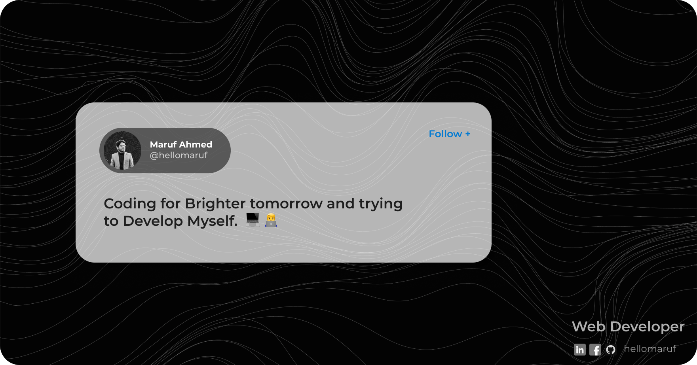

## :chart_with_upwards_trend: Current Stats

 

  

## :mailbox: Reach me out

 

[
](https://www.linkedin.com/in/mirhussainmurtaza/)[ 
](https://twitter.com/_mir_hussain_)

 

## :computer: Technologies that I know

 

 

## :eyes: Current overview

### 🔭 I’m working - In Programming Hero. 
### 🌱 I’m exploring - Advance motion graphics for web. 
### 👯 I’m looking - To collaborate on open source projects. 
### 🤔 I’m trying - To help people learn web development. 
### ⚡ Fun fact - I love to make complex origami and I can speak 5 languages.

 

## :book: My recent blog posts
<!-- BLOG-POST-LIST:START -->
- [Common interview questions that you need to know as a junior JavaScript developer.](https://dev.to/mirhussain/common-interview-questions-that-you-need-to-know-as-a-junior-javascript-developer-29a6)
- [What the heck is JSX in React.](https://dev.to/mirhussain/what-the-heck-is-jsx-in-react-3f0a)
- [A cleaner approach to write JavaScript &lpar;Bonus tips in the end.&rpar;](https://dev.to/mirhussain/a-cleaner-approach-to-write-javascript-bonus-tips-in-the-end-58ng)
<!-- BLOG-POST-LIST:END -->
